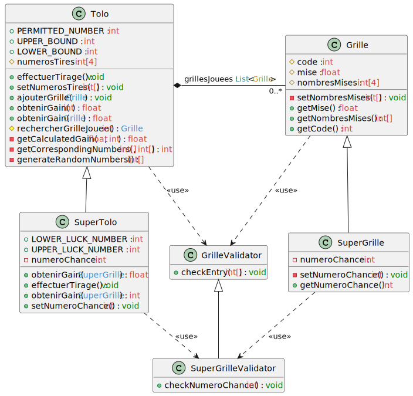

# TP3

# Informations
Nom : REHUA
Prénom : Manuvai

Lien vers le dépôt Github : https://github.com/manuvai/M2_MIAGE_IPM_POO_TP3

# Diagramme de classes

# Services de l'application
## Définition du service
L'utilisation des services est faite dans la classe `Main`

## Tests et validation
Les tests unitaires sont définis dans le package `tests.res`

